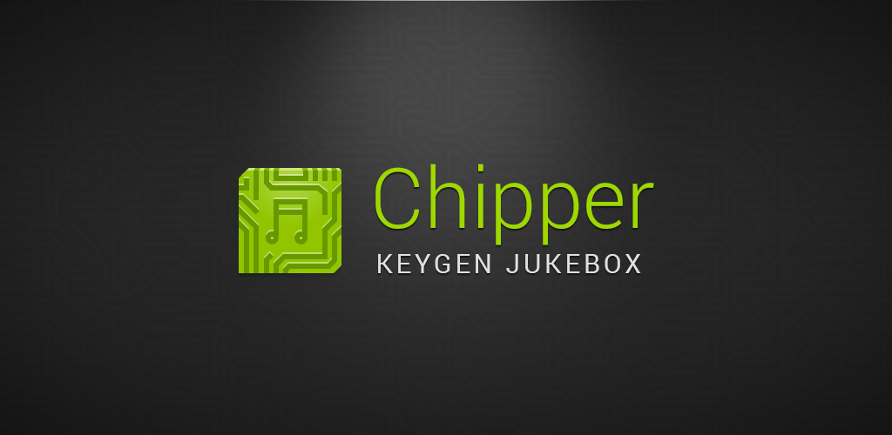

Chipper
=======

A keygen jukebox with over 1400 chiptunes sourced from key generators to play from. Create playlists and have them automatically synced to the [Chipper Server](https://github.com/r0adkll/chipper-java-server) and synced across all of you devices. Join the community and upgrade to premium to be able to vote on chiptunes and contribute to the popular list.

## Version 2.0

This new version will now support a broader range of devices:

- Android 5.0 Lollipop w/ Material Design
- Android Wear
- Android TV
- Web (Eventually)
- iOS/OSX (hopefully sometime in the future)

## Pricing

1.  **Free**  
  - Ads
  - Limited voting (10 votes a day)
  - No Offline
  - No Ringtones
  - No Sharing (Only Redeem)

1a. **Silver - $0.99**
  - Removes Ads
  - Reduces 'Premium' price to $1.99
  - Limited voting(+50 votes a day)
  - Share Playlists

2.  **Premium - $2.99**  
  - No Ads  
  - Unlimited Voting  
  - Offline caching  
  - Ringtone features  
  - Share Playlists

## Android TV

This will support AndroidTV  
__INDEV - Demo 1__ is ready for GDG

## Web (Coming Soon!)

There will be a web interface where user's can sign-in with G+ or Chipper Creds and manage their account information, devices, playlists, and more. This is also where a user can redeem shared playlists (if not on a mobile device).

